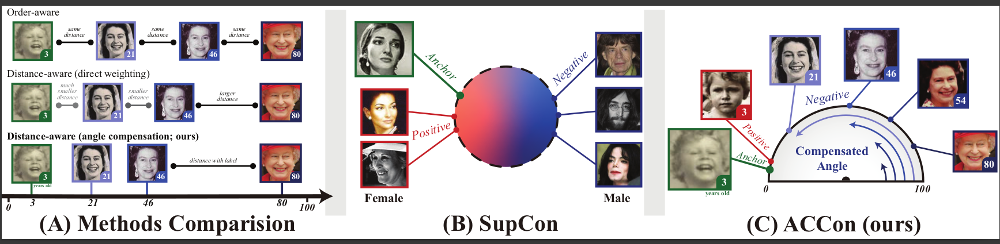

# ACCon: Angle-Compensated Contrastive Regularizer for Deep Regression


<p align="center">
     <br>

[//]: # (<b>ConR </b> key insights. a&#41; Without ConR, it)

[//]: # (is common to have minority examples mixed with)

[//]: # (majority examples. b&#41; ConR adds additional loss)

[//]: # (weight for minority, and mis-labelled examples,)

[//]: # (resulting in better feature representations and c&#41;)

[//]: # (better prediction error.)

[//]: # (</p>)

## Quick Preview
<b>ACCon </b> is complementary to conventional imbalanced learning techniques. The following code snippent shows the implementation of ConR for the task of Age estimation

```python
    def forward(self, features, labels=None):
        batch_size = features.size()[0]
        if len(features.shape) < 3:
            raise ValueError('`features` needs to be [bsz, n_views, ...],'
                             'at least 3 dimensions are required')
        if len(features.shape) > 3:
            features = features.view(features.shape[0], features.shape[1], -1)

        contrast_count = features.shape[1]
        contrast_feature = torch.cat(torch.unbind(features, dim=1), dim=0)

        anchor_feature = contrast_feature
        anchor_count = contrast_count

        dist = (labels - labels.T).float().cuda()
        mask = torch.eq(labels, labels.T).float().cuda()
        dist = dist.repeat(anchor_count, contrast_count)
        mask = mask.repeat(anchor_count, contrast_count)

        phi = (1 - dist / self.max_inernal) * np.pi

        cos_phi = torch.cos(phi)
        sin_phi = torch.sin(phi)

        cos_theta = torch.matmul(anchor_feature, contrast_feature.T)
        cos_theta = torch.clamp(cos_theta, -1, 1)
        sin_theta = torch.sqrt(1 - cos_theta ** 2 + self.tau)

        logits = torch.div(cos_theta, self.temperature)
        logits_max, _ = torch.max(logits, dim=1, keepdim=True)
        logits = logits - logits_max.detach()

        logits_mask = torch.scatter(torch.ones_like(mask), 1,
                                    torch.arange(batch_size * anchor_count).view(-1, 1).cuda(), 0)

        mask = mask * logits_mask

        neg_logit = torch.div(cos_theta * cos_phi - sin_theta * torch.abs(sin_phi), self.temperature)
        neg_logit[mask == 1] = logits[mask == 1]
        exp_logits = torch.exp(neg_logit) * logits_mask

        log_prob = logits - torch.log(exp_logits.sum(1, keepdim=True))
        mean_log_prob_pos = ((mask * log_prob).sum(1) + self.tau) / (mask.sum(1) + self.tau)

        loss = - (self.temperature / self.base_temperature) * mean_log_prob_pos
        loss = loss.view(anchor_count, batch_size).mean()
        return loss

```

## Usage

Please go into the sub-folder to run experiments for different datasets. 

- [IMDB-WIKI](./imdb-wiki)
- [AgeDB](./agedb)
- [STS-B](./sts-b)


## Acknowledgment

The code is based on 
[Yang et al., Delving into Deep Imbalanced Regression, ICML 2021](https://github.com/YyzHarry/imbalanced-regression/tree/main/imdb-wiki-dir), 
[Ren et al.,Balanced MSE for Imbalanced Visual Regression, CVPR 2022](https://github.com/jiawei-ren/BalancedMSE), 
and [Keramati et al., ConR: Contrastive Regularizer for Deep Imbalanced Regression](https://github.com/BorealisAI/ConR). 
